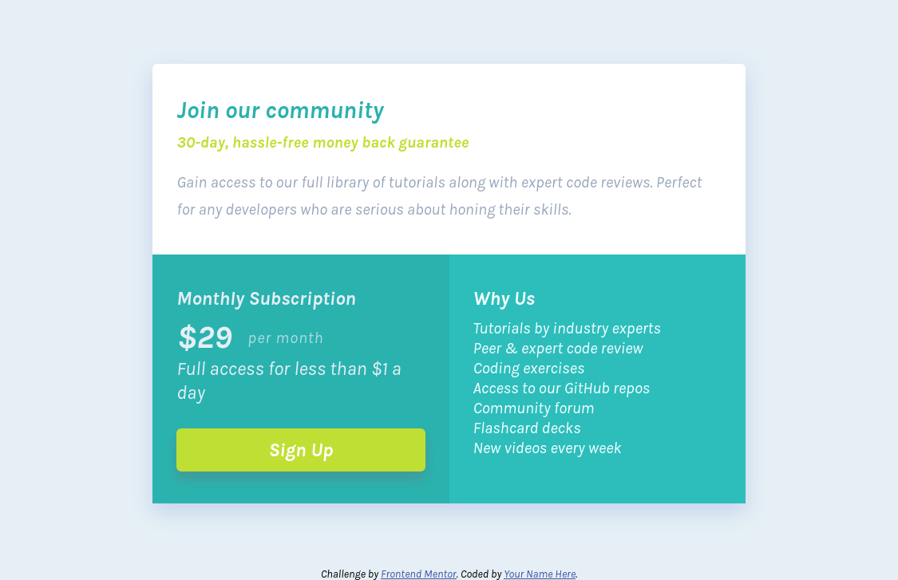

# Frontend Mentor - Single price grid component solution

This is a solution to the [Single price grid component challenge on Frontend Mentor](https://www.frontendmentor.io/challenges/single-price-grid-component-5ce41129d0ff452fec5abbbc). Frontend Mentor challenges help you improve your coding skills by building realistic projects. 

## Table of contents

- [Frontend Mentor - Single price grid component solution](#frontend-mentor---single-price-grid-component-solution)
  - [Table of contents](#table-of-contents)
  - [Overview](#overview)
    - [The challenge](#the-challenge)
    - [Screenshot](#screenshot)
    - [Links](#links)
  - [My process](#my-process)
    - [Built with](#built-with)
    - [What I learned](#what-i-learned)
    - [Continued development](#continued-development)
  - [Author](#author)


## Overview

### The challenge

Users should be able to:

- View the optimal layout for the component depending on their device's screen size
- See a hover state on desktop for the Sign Up call-to-action

### Screenshot




### Links
- Solution URL: https://github.com/tburette/frontendmentor-single-price-grid-component
- Live Site URL: https://tburette.github.io/frontendmentor-single-price-grid-component

## My process

### Built with

- Semantic HTML5 markup
- CSS custom properties
- CSS Grid
- Mobile-first workflow
- [CDN fonts](https://www.cdnfonts.com/) - For font CDN

### What I learned

I defined the colors twice: 
- first the colors given by the instructions (cyan, bright-yellow,...).
- a second time to have semantic names for colors (color-intro-title,..)

It is overkill for this small task but it could be useful as part of a 
design system in a larger site.

```css
--cyan: hsl(179, 62%, 43%);
--bright-yellow: hsl(71, 73%, 54%);
--light-gray: hsl(204, 43%, 93%);
--grayish-blue: hsl(218, 22%, 67%);

--color-intro-title: var(--cyan);
--color-intro-accent: var(--bright-yellow);
--color-intro-text: var(--grayish-blue);
/* ... */
```

To prevent the design to suddenly shift at the breakpoint I used this:
```css
@media (min-width: 500px) {
  main {
    /* Min value of clamp to avoid margin suddenly shrinking at breakpoint.
    Max value to avoid text too wide on large screens.*/
    width: clamp(calc(500px * 0.85), 66%, 60rem);
  }
  /*...*/
}
```

### Continued development

I should think of using a standard CSS reset for all future projects 
instead of recreating one each time depending on the needs.

Which one? One with `min-width: 0;` to avoid the annoying builtin min-width
on some elements such as `<input type="text">` that tend to break 
flex designs when it becomes narrow.

I wasn't sure how to write the `box-shadow` to do the shadow under the button.  
Using `black`, the shadow was either too black or too big.  I ended up with
a hack : I hardcoded a color slightly darker than the background.


## Author

- Website - [Thomas Burette](http://thomasburette.com/)
- Frontend Mentor - [@tburette](https://www.frontendmentor.io/profile/tburette)
- Twitter - [@tburette](https://twitter.com/tburette)